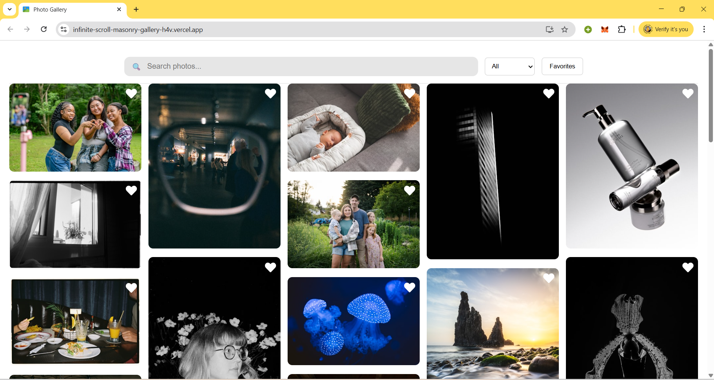
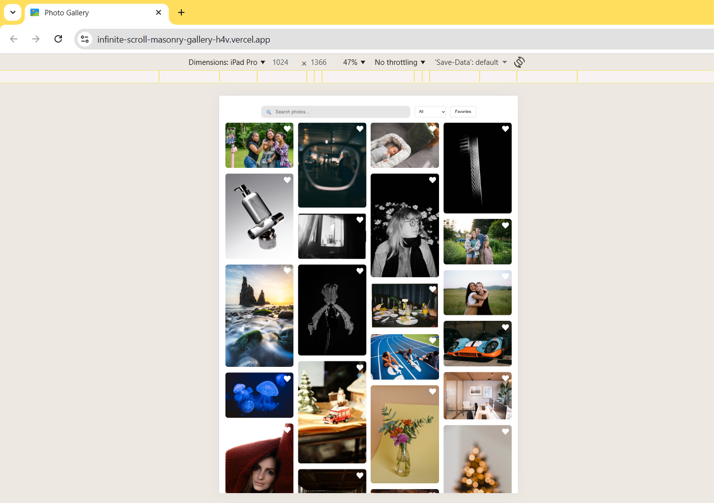

# Infinite Scroll Masonry Photo Gallery

A modern, responsive photo gallery built with React and the Unsplash API.  
Features include infinite scrolling, masonry layout, search, filtering, favorites, lazy loading, and responsive UI.

---

## Live Demo

**Deployed URL:**  
https://infinite-scroll-masonry-gallery-h4v.vercel.app/

---

## Features

### Infinite Scroll
Automatically loads additional photos as the user scrolls using IntersectionObserver.

### Masonry Layout
Pinterest-style responsive layout using `react-masonry-css`.

### Debounced Search
Search photos with a 500ms debounce to reduce unnecessary API calls.

### Orientation Filter
Filter photos by:
- Landscape  
- Portrait  
- Square  
- All  

### Favorites System
- Add or remove photos as favorites  
- Persisted in localStorage  
- “Show Favorites” view available  

### Modal View & Download
- Click any photo to open a modal  
- Download full-resolution images  

### Lazy Loading
Images load only when they are visible on screen for better performance.

### Responsive Design
Optimized layout for mobile, tablet, and desktop screens.

---

## Tech Stack

| Purpose | Technology |
|---------|------------|
| Frontend | React |
| API | Unsplash API |
| Layout | react-masonry-css |
| Modal | ReactModal |
| State | React Hooks & localStorage |
| Deployment | Vercel |

## Setup Instructions

### 1. Clone the Repository
git clone https://github.com/NandinipriyaM/infinite-scroll-masonry-gallery
cd infinite-scroll-masonry-gallery
### 2️⃣ Install Dependencies
npm install

### 3️⃣ Unsplash API Setup

Create a .env.local file in the root of the project:

REACT_APP_UNSPLASH_ACCESS_KEY=your_unsplash_access_key

### Restart the development server:

npm start

Running the App
Development Server
npm start

Production Build
npm run build

## Deployment (Vercel)
1. Go to Vercel

https://vercel.com

2. Import GitHub Repository

Connect your repository to Vercel.

3. Add Environment Variable
REACT_APP_UNSPLASH_ACCESS_KEY=your_access_key

4. Deploy

Click Deploy. Vercel will generate a live URL automatically.

## Demo Video

Demo video showing:

Searching photos

Infinite scrolling

Filtering

Adding & viewing favorites

Modal view & download

Responsive behavior

Video Link:
https://youtu.be/PZ01ZONL12A
## Screenshots

### Desktop View

### Tablet View

### Mobile View
